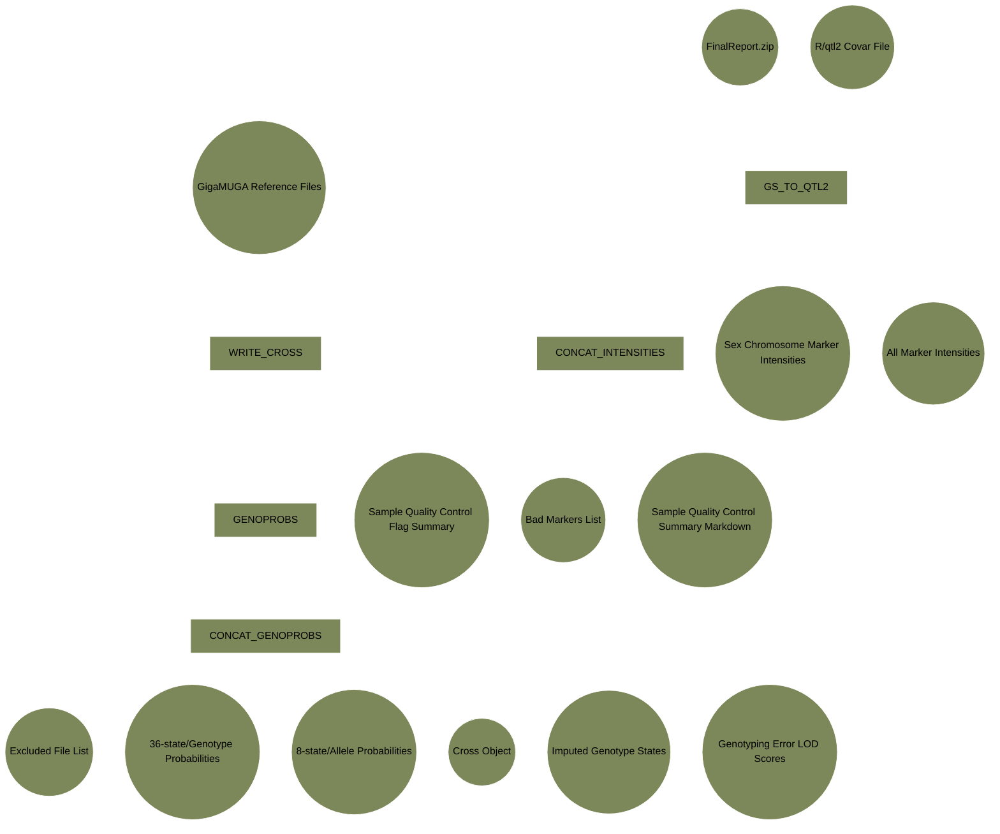

# haplotype_reconstruction_qtl-nf: A slim Nextflow pipeline for mouse cross haplotype reconstruction and quality control

JAX users are required to have access to the Sumner cluster, and to have Nextflow installed in their home directory. Any setup for external users will require additional support, and those wishing to share these workflows are encouraged to contact the maintainers of this repository.

This pipeline is implemented using [Nextflow](https://www.nextflow.io/), a scalable, reproducible, and increasingly common language used in the development and maintenance of bioinformatics workflows. The modular nature of the workflow is enabled by software containers, such as [Docker](https://www.docker.com/) and [Singularity](https://sylabs.io/singularity), with all the software requirements for executing each step. Specific combinations and versions of software are specified in each container making analyses perfectly reproducible over time as long as the source data is unchanged.

## Execution:

Clone the repository using the standard procedure. On the JAX HPC, from within the cloned `haplotype_reconstruction_qtl-nf` directory:

``` bash
sbatch run_scripts/run_HR_QC.sh
```

## Overview:

The structure of the workflow is currently as follows:

```         
├── bin
│   ├── CC_DO_data
│   └── scripts
├── config
├── main.nf
├── modules
│   ├── general
│   ├── markdown
│   └── qtl2
├── nextflow.config
├── projects
│   ├── [project1_name]
│   │   ├── covar_files
│   │   ├── neogen_finalreports
│   ├── [project2_name]
│   │   ├── covar_files
│   │   ├── neogen_finalreports
│   └── [project3_name]
│       ├── covar_files
│       ├── neogen_finalreports
├── run_scripts
│   └── run_HR_QC.sh
├── SampleQC_Haplotype_Reconstruction_report.html
├── sample_sheets
│   └── test_sheet.csv
├── singularity_cache
└── workflows
    └── SampleQC_Haplotype_Reconstruction.nf
```

The run script `run_HR_QC.sh` specifies only one user--generated comma-separated sample manifest with four named columns: **finalreport_file**, **project_id**, **covar_file**, and **cross_type** (see README within `sample_sheets` subdirectory).

The pipeline reads in the raw genotypes from GigaMUGA FinalReport files and makes them into files amenable to analysis using R/qtl2. These include cross files, genotype probabilities, allele probabilities, imputed genotypes from probabilities (`maxmarg` output).

Files used for sample and genotype quality control are also generated, such as inferred genotyping errors, poorly performing markers, and a markdown document outlining results from sex checks and calculations of sample duplication.


